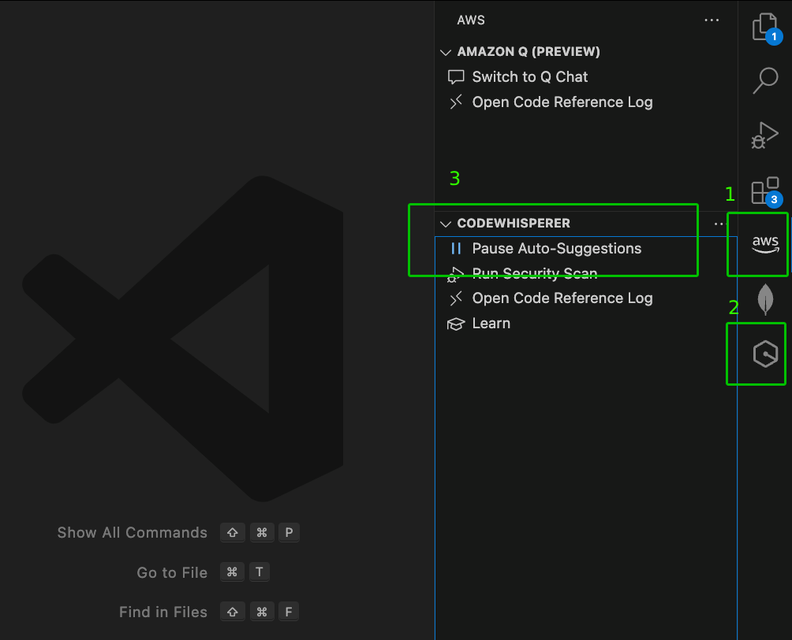
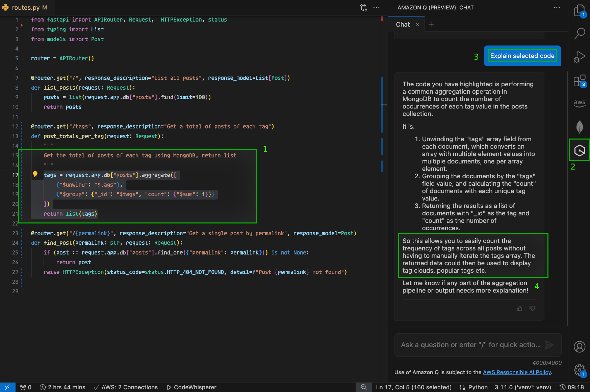

## MongoDB + CodeWhisperer

Quick demo that shows how using CodeWhisperer and MongoDB can boost developer productivity.

**Context:** This is an API (built with FastAPI) that provides access to a articles (`posts`) stored in MongoDB. During the demo we'll augment the API to provide access to the posts via a customizable link (`permalink`) and to be able to retrieve the total posts by tags. **Most of the changes will be writen by CodeWhisperer, showcasing how it can boost developer productivity**.

**Key Takeaways:** How CodeWhisperer, trained with MongoDB dataset, can boost developer productivity in real-world API & Application developement.

### Step 0 (Preparation)

**a)** Make sure **python3** is installed. **Step 1** (see below) will ensure you have all dependencies installed on a virtual environment.

**b)** Ensure the **AWS Toolkit extension** is installed and that you sign-in to use CodeWhisperer. You may have to sign-in using a personal account (as the MongoDB account currently have some permission restrictions). You can follow [this guide](https://www.mongodb.com/developer/products/mongodb/getting-started-with-mongodb-and-codewhisperer/).

Once the extension is properly installed you should see the following:


1 - _AWS buttom_ visible on the _Activity Bar_.<br>
2 - _Amazon Q buttom_ visible on the _Activity Bar_.<br>
3 - In AWS's Toolkit (click on _AWS buttom_), Auto-Suggestion enabled.<br>

**c)** Make sure you have a **MongoDB Atlas cluster** with the **[sample dataset loaded](https://www.mongodb.com/docs/atlas/sample-data/#load-sample-data)**. This demo uses the `sample_training` dataset.

**d)** Copy the `.env.example` file to `.env` and replace `ATLAS_URI` with the proper connection string of your Atlas cluster.

### Step 1

Create a virtual environment (an isolated python enrivonment), install dependencies and run the application using the following commands:

```sh
python3 -m venv venv            # create python virtual env
source venv/bin/activate        # activate virtual env
pip install -r requirements.txt # install dependencies

uvicorn main:app --reload       # run web server
```

Now that the application is running with `uvicorn`, proceed to show how it works.

### Step 2

Show how the API works

Access a list of documents
http://127.0.0.1:8000/posts/

Access a single document using its `ObjectId`
http://127.0.0.1:8000/posts/50ab0f8bbcf1bfe2536dc3fa

Show structure of a single document, and tell that it would be ideal to be able to get a document by its `permalink` and not by its `ObjectId`.
The `permalink` is a customizable string that can reflect the actual article title.

Try to access a document by its permalink
http://127.0.0.1:8000/posts/jNsgObovWyKEoXNydtis

> ℹ️ The `ObjectId` and the `permalink` above already exist in the sample dataset

### Step 3

Let's use CodeWhisperer to update the get route to use the `permalink` instead of the `ObjectId`

On `routes.py` delete everything below `def find_post(id: id,` and alter the route declaration to the following:

```py
@router.get("/{permalink}", response_description="Get a single post by permalink", response_model=Post)
def find_post(permalink: str, request: Request):
  	█
```

Place your cursor on the position of the block character above (`	█`) and CodeWhisperer should autocomplete with the proper suggestion. Ideally the suggestion will look like the following:

```py
@router.get("/{permalink}", response_description="Get a single post by permalink", response_model=Post)
def find_post(permalink: str, request: Request):
    if (post := request.app.db["posts"].find_one({"permalink": permalink})) is not None:
        return post
    raise HTTPException(status_code=status.HTTP_404_NOT_FOUND, detail=f"Post with permalink {permalink} not found")
```

Save the file.

### Step 4

Since `uvicorn` is running, it should auto-reload the changes automatically.

Try to access a document by its permalink. This time it should work. ✅
http://127.0.0.1:8000/posts/jNsgObovWyKEoXNydtis

### Step 5

Now tell the audience about a requirement of displaying the total amount of posts of each tag. Explain how it would require a new route to run a MongoDB aggregation to make it possible.

**before** `@router.get("/{permalink}"` add the following code snippet:
> ⚠️ it's important this is added before the permalink route!

```py
@router.get("/tags", response_description="Get a total of posts of each tag")
def post_totals_per_tag(request: Request):
    """
    Get the total of posts of each tag using MongoDB, return list
    """
    █
```

Place your cursor on the position of the block character above (`	█`) and CodeWhisperer should autocomplete with the proper suggestion. Ideally the suggestion will look like the following:

```py
@router.get("/tags", response_description="Get a total of posts of each tag")
def post_totals_per_tag(request: Request):
    """
    Get the total of posts of each tag using MongoDB, return list
    """
    return list(request.app.db["posts"].aggregate([
        {"$unwind": "$tags"},
        {"$group": {"_id": "$tags", "total": {"$sum": 1}}}
        # {"$project": {"_id": 0, "tag": "$_id", "total": 1}} # valid (CodeWhisperer might suggests this)
    ]))
```

> ⚠️ it's important the result is converted into a **list**. AKA: `list()`

> ℹ️ CodeWhisperer might suggest additional lines (often comments showing what the output looks like). You can discard those lines or use _`Cmd/CTRL`+`->`_ to accept just the code portion of its suggestion.

### Step 6

1 - Select the aggregation the body of the function that was generated in the previous step.
In the example above, this is the portion that should be selected:

```py
    return list(request.app.db["posts"].aggregate([
        {"$unwind": "$tags"},
        {"$group": {"_id": "$tags", "total": {"$sum": 1}}}
        # {"$project": {"_id": 0, "tag": "$_id", "total": 1}} # valid (CodeWhisperer might suggests this)
    ]))
```

2 - In the Activity Bar, select Amazon Q and ask the following to it:

3 - **"`Explain selected code`"**

> ℹ️ feel free to click in the "explain selected code" suggestion if it shows up

4 - Quickly read the response and highlight how useful it is for developers to quickly understand portions of the code that they are not familiar with.

Here's how Step 6 should look like:




### Step 7

Debrief

Shut down `uvicorn` with _`Ctrl`+`C`_

Deactivate's python virtual environment by running `deactivate` on the terminal

```sh
deactivate # once done, deactivate venv
```
